# Charm Nail Salon

         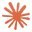   

## Introduction

Charm is a professional nail salon website created for Mirjana Vuković Đorđić, a nail artist based in Bijeljina, Bosnia & Herzegovina. The aim was to give her an elegant and trustworthy online presence that reflects the quality and creativity of her work. With over four years of professional experience and a formally recognised qualification, Mirjana specialises in nail art, gel nails, gel lac, manicure, acrylic nails, and rubber base — and the site was built to showcase that range with clarity and style.

The site achieves this by presenting her services, pricing, and portfolio in a clean, visually driven layout. Visitors can learn about Mirjana, browse her gallery of work, view pricing, and get in touch directly. The gallery features both photos and videos, hosted via Vercel Blob and Cloudinary, giving prospective clients a real feel for the standard of work they can expect. The site also supports both English and Serbian, reflecting Mirjana's bilingual client base.

This was a freelance project built for a client abroad, combining a real-world brief with the challenge of delivering a polished, production-ready product. From designing the layout to integrating media hosting and deploying the final result, every decision was made with Mirjana's clients in mind.

You can view the website [here](https://charm-nail-salon.vercel.app/).

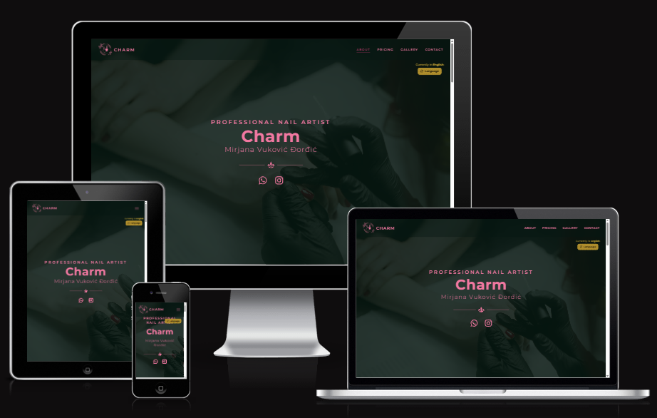

## User Experience

### User Stories

**Browsing & Discovery**

- As a user, I want to see example nail work in a gallery so I can judge the quality and style before booking.
- As a user, I want to view pricing information so I know what to expect before reaching out.
- As a user, I want to read about the nail technician's background and qualifications so I can feel confident in their expertise.

**Language**

- As a Serbian-speaking user, I want to switch the site to Serbian so I can read it in my native language.

**Accessibility & Experience**

- As a user, I want the site to work well on my phone so I can browse on the go.
- As a user, I want the gallery to open images in a lightbox so I can view them clearly without leaving the page.
- As a user, I want the site to load quickly even with many photos so I am not waiting around.

**Admin**

- As the salon owner, I want to upload and delete gallery photos through a protected admin panel so I can keep the portfolio up to date without touching code.

### Design

Charm embraces an elegant aesthetic designed to reflect the artistry and precision of professional nail care. Its rich visuals, refined colour palette, and fluid animations create an atmosphere of quiet luxury — one that feels aspirational without being out of reach. The layout is intentionally spacious and visual-first, letting the work speak for itself through a curated gallery and cinematic hero section. Clear navigation and a well-defined visual hierarchy guide visitors naturally from discovery to contact, while the bilingual toggle ensures the experience feels personal and inclusive for both English and Serbian-speaking clients. Fully responsive across all devices, the site is as polished on mobile as it is on desktop. More than a portfolio, Charm is a first impression — built to inspire confidence and make a prospective client feel they are already in good hands.

#### Colour palette


The palette blends deep forest green, soft pink, and gold to evoke luxury, femininity, and refinement. Green grounds the design with calm sophistication, pink brings warmth and creativity, and gold signals premium quality — together creating an atmosphere that feels intimate, elegant, and distinctly on-brand for a high-end nail salon.

#### Typography

Cormorant Garamond is used for headings and Montserrat for body text. The pairing is a classic contrast — Cormorant's high-contrast serif brings an editorial, high-fashion quality to titles, while Montserrat's clean geometry keeps the body copy crisp and readable. Together they balance elegance with clarity, reinforcing the salon's premium yet approachable character.

#### Wireframes

The wireframe was designed for desktop only, as the mobile and tablet layouts follow predictable reflow patterns — the navbar collapses into a hamburger menu, the about section stacks into a single column, and the gallery shifts from three columns on tablet to two on mobile. These adaptations were straightforward enough to implement without dedicated wireframes. It can be viewed here:

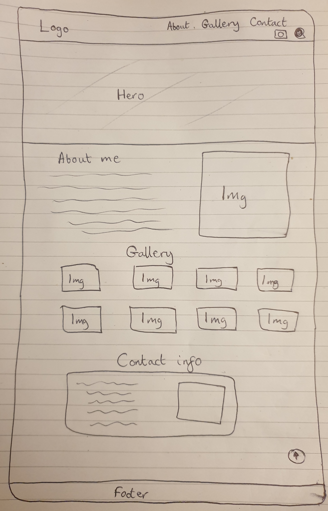

The wireframe does not fully correspond with the end product due to multiple changes made throughout the production phase.

## Features

### Current features

The website is fully responsive across all devices and supports both English and Serbian through a language toggle that persists across the session via a cookie. All interactive buttons feature a custom cascade hover animation that ripples outward from the cursor position.

#### Navbar

The navbar is fixed to the top of the page and uses an intersection observer to highlight the active section as the user scrolls. On desktop it displays navigation links inline; on mobile it collapses into a hamburger menu with a dropdown overlay.

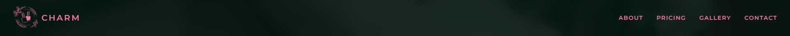
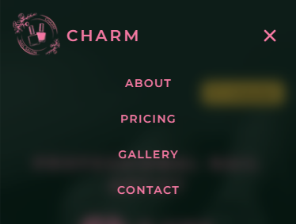
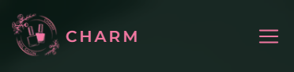

#### Hero

A fullscreen video hero section plays looping clips of nail work, fading between them automatically. The language toggle is accessible directly from this section on the top right.

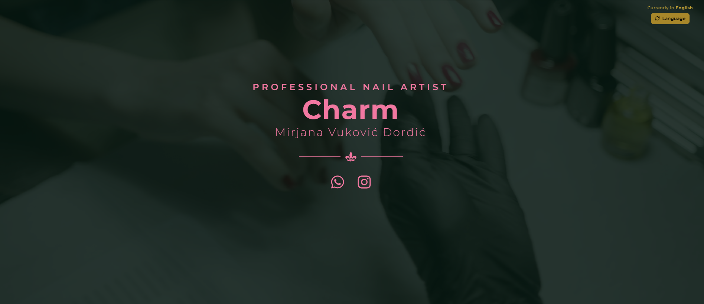
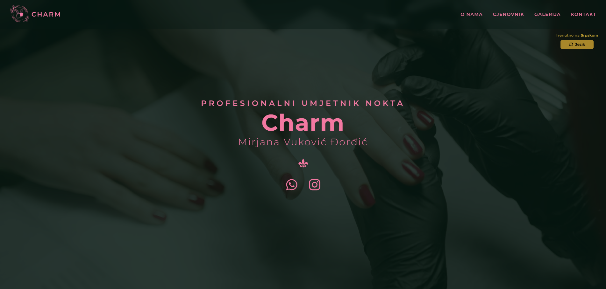

#### About

The about section introduces Mirjana with a brief biography and a link that opens a lightbox modal displaying her formal qualification certificate.

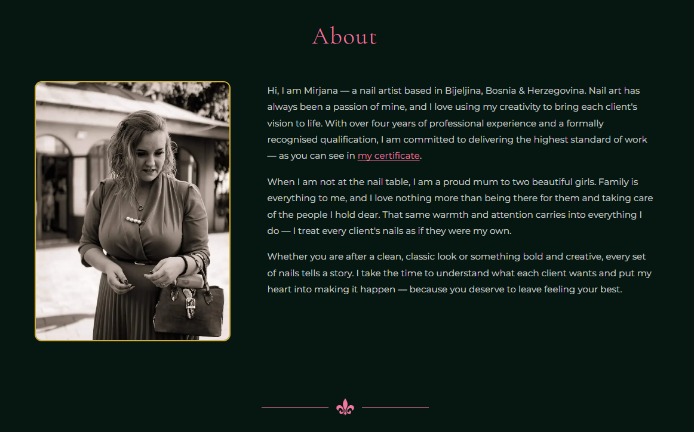


#### Pricing

The pricing section presents a responsive pricing card with a background image that adapts to screen size.

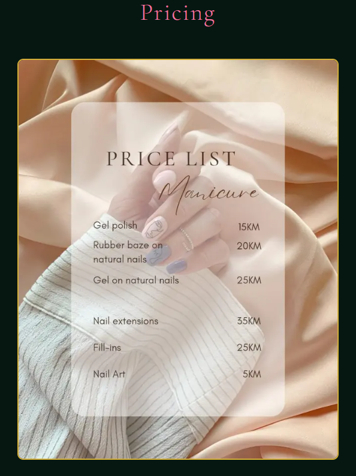

#### Gallery

The gallery displays photos in a responsive grid fetched from Vercel Blob storage. Clicking a photo opens it in a fullscreen lightbox modal. At 324px and below the lightbox is disabled. An Instagram link is included beneath the grid.

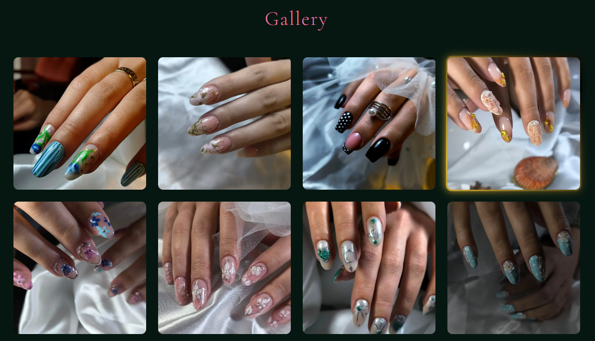
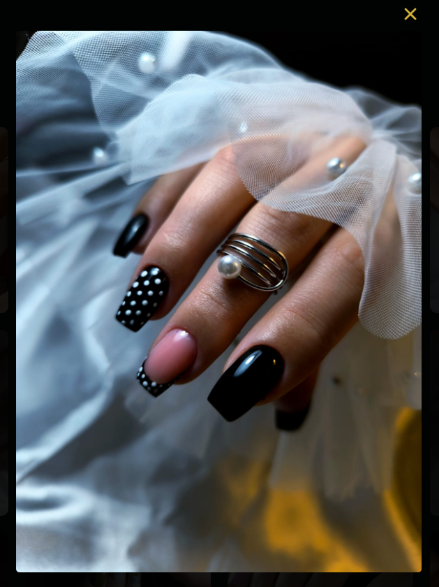
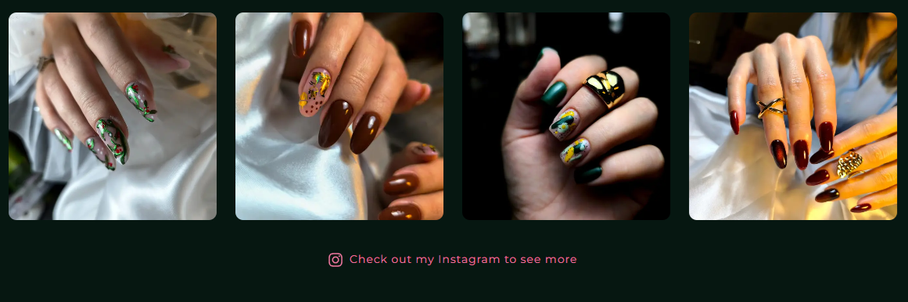

#### Contact

The contact section provides a WhatsApp link so visitors can reach Mirjana directly.

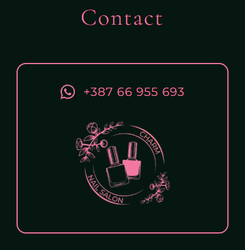

#### Footer

A minimal footer displays the copyright notice and a link to the GitHub repository.

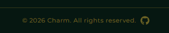

#### Divider

A decorative pink divider separates each major section of the page.

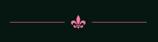

#### Scroll to top

A scroll-to-top button appears once the user scrolls past the hero section, allowing quick navigation back to the top.


#### Admin panel

A password-protected admin panel at `/admin` allows the salon owner to manage the gallery without touching code. Photos can be uploaded or deleted, with confirmation dialogs and clear status messages for success and error states. Duplicate file name detection prevents accidental overwrites.

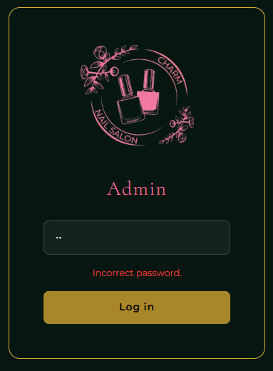
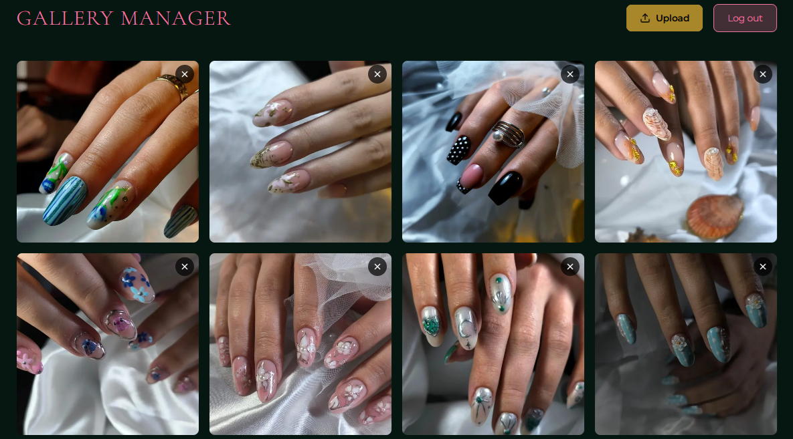
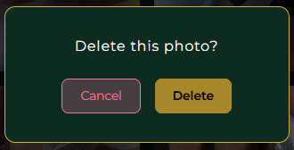
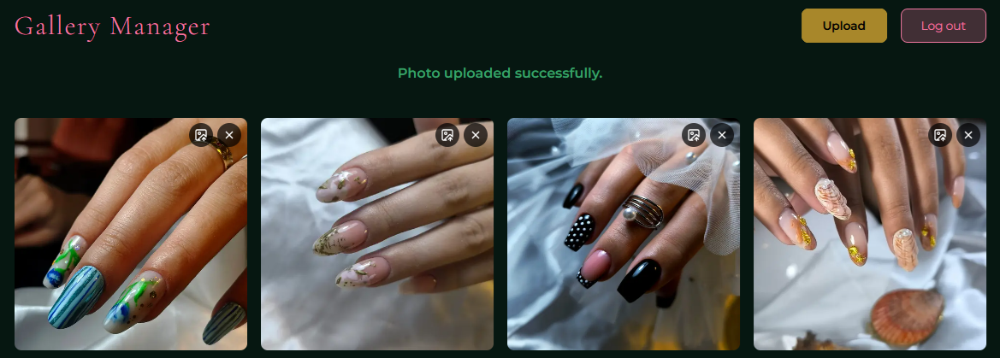
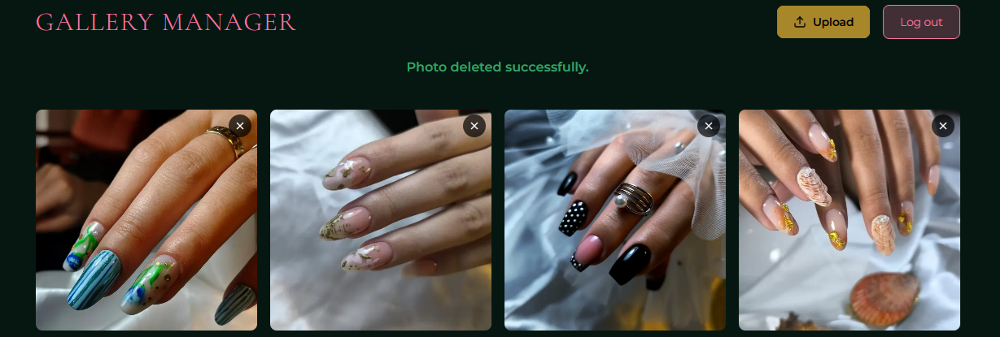
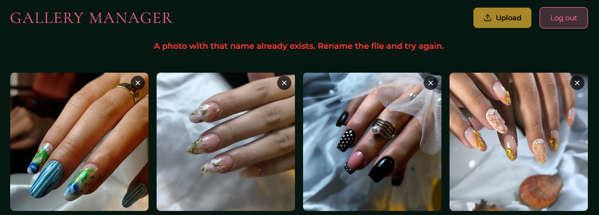

### Future features

- Video upload support for the gallery alongside existing photo uploads.
- Appointment booking integration so clients can request a slot directly from the site.

## Technologies used

### Languages

- HTML5
- CSS3
- TypeScript
- React

### Frameworks, libraries and programs used

- [Next.js](https://nextjs.org/) used as the React framework for server-side rendering and routing.
- [Tailwind CSS](https://tailwindcss.com/) used for utility-first styling.
- [Vitest](https://vitest.dev/) used for unit testing.
- [Cloudinary](https://cloudinary.com/) used to host and serve gallery videos.
- [Vercel](https://vercel.com/) used to deploy the website and host gallery images via Vercel Blob storage.
- [Vercel Blob](https://vercel.com/docs/storage/vercel-blob) used to store and serve gallery photos.
- [Neon](https://neon.tech/) used to host gallery images.
- [Axios](https://axios-http.com/) used for HTTP requests to the photos API.
- [Lucide React](https://lucide.dev/) used for icons.
- [React Icons](https://react-icons.github.io/react-icons/) used for icons.
- [Coolors](https://coolors.co/) used to display the colour palette used on the website.
- [Google Fonts](https://fonts.google.com/) used to import fonts.
- [Github](https://github.com/) used to host the repository and manage version control.
- [VSCode](https://code.visualstudio.com/) used as the code editor/IDE to develop the project.
- [Lighthouse](https://developer.chrome.com/docs/lighthouse/overview/) used for performance review.
- [AmIResponsive](https://fireship.dev/amiresponsive) used to display website on the most common devices.
- [Remove.bg](https://www.remove.bg/) used to remove backgrounds from images.
- [Canva](https://www.canva.com/) used to create the logo.
- [Claude Code](https://claude.ai/code) used to assist with development.

## Testing

### Validator testing

#### W3C HTML Validator

The deployed site was validated using the [W3C HTML Validator](https://validator.w3.org/). The only notice returned was a trailing slash on void elements (e.g. `<meta />`), which is a known artifact of Next.js rendering JSX to HTML and has no practical effect on how browsers parse the page.

#### W3C CSS Validator

The stylesheet was validated using the [W3C CSS Validator (Jigsaw)](https://jigsaw.w3.org/css-validator/). All warnings returned were informational only:

- **CSS variables not statically checked** — the validator cannot evaluate `var(--brand-pink)` etc. at parse time as they are resolved at runtime. This is a known validator limitation.
- **`pointer-events: auto` not defined by specification** — while technically not in the spec, this value is universally supported across all browsers and functions as the standard reset value.
- **Imported style sheets not checked** — refers to `@import "tailwindcss"`, which the validator cannot fetch and check at validation time.

No errors were found.

#### ESLint / TypeScript

The project was linted using ESLint and the TypeScript compiler with no errors:

```bash
npx eslint src
npx tsc --noEmit
```

### Testing user stories

**Browsing & Discovery**

As a user, I want to see example nail work in a gallery so I can judge the quality and style before booking.
→ A responsive photo gallery on the main page displays Mirjana's work, fetched from Vercel Blob storage and presented in a clean grid layout.

As a user, I want to view pricing information so I know what to expect before reaching out.
→ A dedicated pricing section on the main page presents a pricing card with all relevant information.

As a user, I want to read about the nail technician's background and qualifications so I can feel confident in their expertise.
→ The about section introduces Mirjana with a personal biography and a link that opens her formal qualification certificate in a lightbox modal.

**Contact & Booking**

As a user, I want a contact section so I can reach out directly.
→ The contact section provides a WhatsApp link so visitors can message Mirjana directly.

**Language**

As a Serbian-speaking user, I want to switch the site to Serbian so I can read it in my native language.
→ A language toggle in the hero section switches all site text between English and Serbian, with the preference persisted in a cookie across the session.

**Accessibility & Experience**

As a user, I want the site to work well on my phone so I can browse on the go.
→ The site is fully responsive across all screen sizes, with a collapsible hamburger menu on mobile and adapted grid layouts at each breakpoint.

As a user, I want the gallery to open images in a lightbox so I can view them clearly without leaving the page.
→ Clicking any gallery photo opens it in a fullscreen lightbox modal with a close button and keyboard support (Escape key).

As a user, I want the site to load quickly even with many photos so I am not waiting around.
→ Images are served from Vercel Blob with optimised delivery, and Next.js handles server-side rendering and static optimisation for fast initial load times.

**Admin**

As the salon owner, I want to upload and delete gallery photos through a protected admin panel so I can keep the portfolio up to date without touching code.
→ A password-protected admin panel at `/admin` allows the salon owner to upload and delete photos directly, with confirmation dialogs, duplicate detection, and clear status feedback for every action.

### Lighthouse testing

Lighthouse was a helpful tool for checking where where the website was experiencing the most issues.

- Home page (Desktop / Mobile):

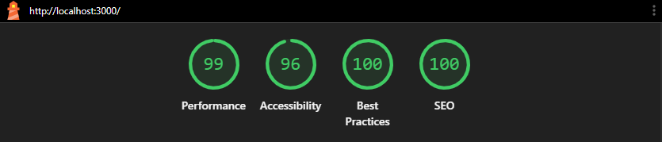 <br>

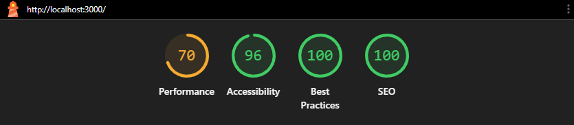 <br>

- Login page (Desktop / Mobile):

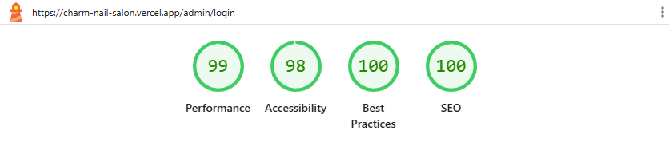 <br>

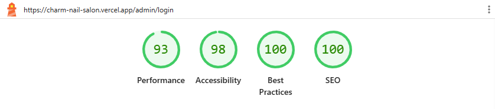 <br>

- Admin gallery page (Desktop / Mobile):

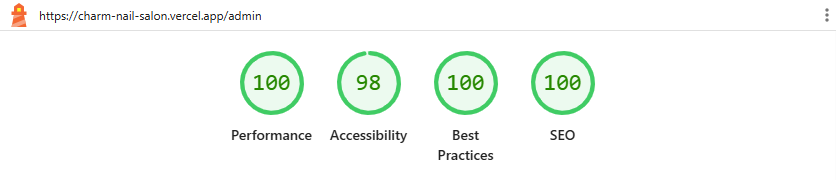 <br>

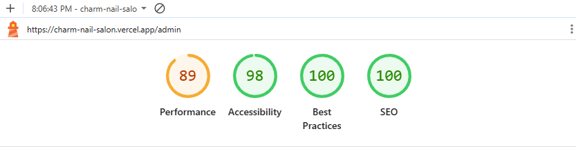 <br>

### Automated testing

Automated tests were implemented across all 23 test files covering every component, page, API route, hook, and utility — 158 tests in total, using Vitest and React Testing Library.

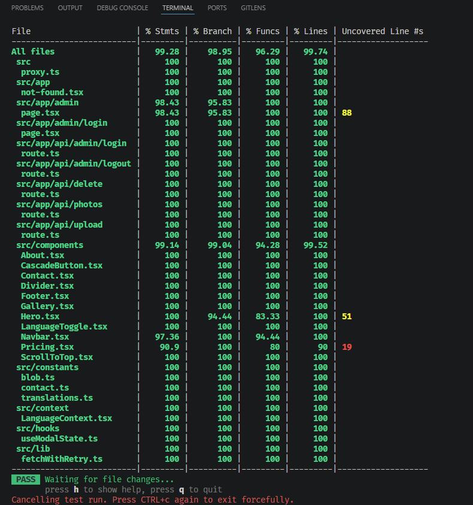

### Bugs

- There is a bug where the page freezes and does not load properly when clicking the back or forward buttons - this is a known NextJS bug.
